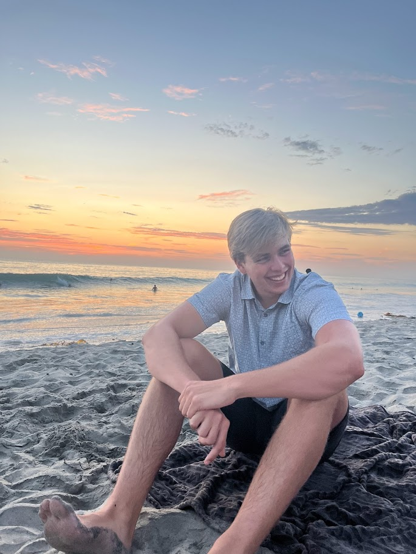

{width="300" fig-align="left" fig-alt="Headshot of Mikkel Christensen"}

## Education

**Brigham Young University**, Provo, UT  
**B.S. in Statistics — Data Science**, *Apr 2027*  
GPA: 3.29/4.00 (Major GPA: 3.57/4.00) · ACT: 30/36

## Experience

**Tax Accountant** — *Synergy Restaurant Management*, Poway, CA  
*May 2025 – Aug 2025*  
- Worked with accountants to book year-end journal entries.  
- Organized and prepared financial statements for several companies.  
- Prepared and filed taxes.

**Sales Representative** — *Immaculate Solutions Inc.*, Los Angeles, CA  
*May 2024 – Aug 2024*  
- Cold-called restaurants across Los Angeles County.  
- Performed free testing of kitchen appliances to test conformity to health laws.  
- Helped grow the company in its early stages.

**Part-time Accountant** — *Synergy Accounting*, Poway, CA  
*Jan 2020 – Feb 2020; Aug 2022 – Present*  
- Managed time efficiently while working remotely.  
- Developed a tip matrix to properly allocate tips among restaurant staff.  
- Recorded Daily Sales Summaries and other recurring accounting entries.

**Finish Carpenter** — *Butler Brothers Cabinets*, Ramona, CA  
*Mar 2022 – Aug 2022*  
- Trusted for unique tasks outside normal operations.  
- Prepared supplies and participated in complex cabinet installations.  
- Consistently chosen for tasks requiring strength and determination.

## Service

**Voluntary Representative** — The Church of Jesus Christ of Latter-day Saints, São Paulo East, Brazil; Orem, Utah  
*Feb 2020 – Mar 2022*  
- Supervised and trained groups of 20–40 volunteer representatives.  
- Taught and trained volunteer representatives upon their arrival in São Paulo.  
- Demonstrated hard work and dedication.

**Misc. Service**
- Volunteered in soup kitchens feeding the homeless; made and distributed hygiene kits  
- Built a house on an Indian reservation in southern Utah for a family in need

## Skills

- **Programming:** Python, C++, VBA, R, Julia, SQL 
- **Data Analysis**: Pandas, NumPy
- **Visualization**: Matplotlib, Seaborn
- **Machine Learning**: Scikit-learn
- **Tools**: Jupyter Notebooks, Git/GitHub, Excel, Tableau 
- **Soft Skills**: People person and high attention to detail
- **Languages:** Portuguese (fluent), Spanish (Read, Understand)

### Areas of Interest
  
- Finance, Business Optimization, Consulting
- Biostats, statistical modeling

## Personal

- Eagle Scout  
- Graduated from high school as part of the California Scholarship Federation  
- Rock-climbing, weightlifting, surfing, swimming, and snowboarding

## Goals

- Machine Learning and Algo-trading
- Work with stats in the fianance world
- Hopefully how to make a ton of money, but i'll settle for slightly lesser goals like becoming profitable

## Get to know me
Hobbies

- Surfing
- Rockclimbing
- Reading
- Guitar 
- Hiking
- Camping

I love spending time outdoors and trying new things. If I had to describe my habits when it comes to hobbies I would say a new one every month and I never finish any of them. The ones listed above are those that have lasted the test of time and are still in my life when possible. I hope to keep learning new things as I get older and find the hobbies that to me are worth pursuing long term and that bring me fulfillment in life.

## Contact

- **Email**: lmikkelc5@gmail.com
- **GitHub**: [https://github.com/lmikkelc5](https://github.com/lmikkelc5)
- **LinkedIn**: [www.linkedin.com/in/lmikkelc5](www.linkedin.com/in/lmikkelc5)

---

*This portfolio showcases my learning progress and projects completed during my data science studies.*
